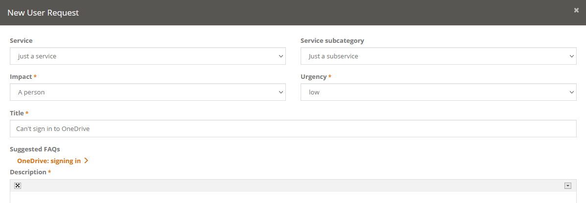
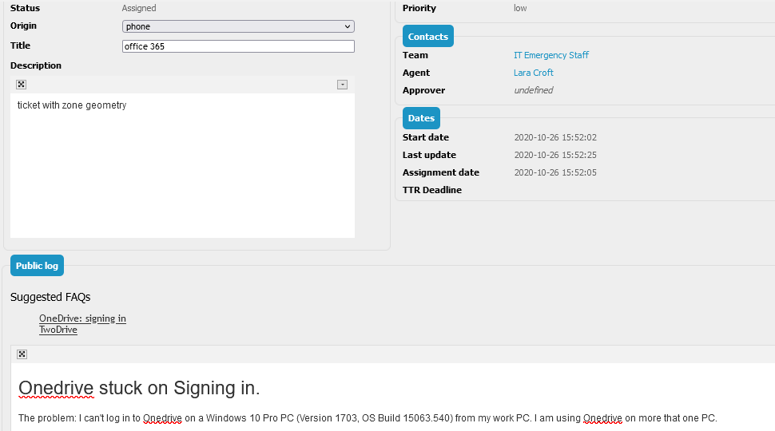

# jb-faq
Copyright (C) 2021 Jeffrey Bostoen

🍻 ☕

Need assistance with iTop or one of its extensions?  
Need custom development? Interested in this extension?
Please get in touch to discuss the terms: **jbostoen.itop@outlook.com**

## What?

⚠ Actively being developed. Early adopters get a discount. This extension is already fully functional.

* Auto-suggest FAQs based on the title of user requests (or tickets of any type)
  * to the user in the portal upon creating a ticket
  * to the agent to include in a public log entry

* Every result will be considered (only the top X will be shown), but sorted by relevance.

**The magic behind the matching**

Note: FAQ means the native FAQ class or a (potentially custom) similar class.

* Only complete stand-alone words are considered. For instance, the search term 'one' will only match the word 'one', but not 'OneDrive'.
* For tag sets, it just checks whether the tag is applied.

The results are chosen by:
* (1) number of tags matched
* (2) number of different search terms found
* (3) total number of occurrences of different search terms

A search term means a single word or a combination of up to (by default, but it's a setting) 3 succeeding words.  
This allows to scan for more precise terms such as "Microsoft Windows Server".  
The score per match is also multiplied by the number of words in the search term.

Different scores can and have to be defined per attribute.  
This way, the iTop administrator can control whether occurrence in for example the title of a FAQ is more significant and needs a higher score. 
It's also possible to make different tag sets less or more significant than others.

Currently the matching mechanism only shows full matches if in the FAQ the word is found (not just "starts with").
For instance, if you have a sentence such as "The OneDrive account can be used by one user":  
The algorithm will find "one" (user), but not OneDrive.  
The algorithm will find "OneDrive".  
The algorithm won't find anything if the user enters "OneDriv", as this does not match the word "one" nor "OneDrive".

## Video presentation

* https://youtu.be/2Z1Sny8LU4g

## Screenshots

Note: screenshots might not be up to date; tweaks may have been made or new features may have been added.  
The screenshots show what it looked like on the 9th of August, 2021.

FAQs are suggested in the user web portal while the user is entering the title.  

FAQs are suggested in the console (back office) while the agent is answering the ticket.  
When the agent clicks a suggestion, the text is inserted into the log.  

## Recommendations

As the description of the FAQ will be displayed in the front end, it's wise to avoid HTML mark up which does not match the user portal.

Also note that the way FAQs are written heavily influences the matching process.  
Add proper key words in the field which will be used for description.  
Also consider adding alternative key words in other (even hidden) fields.  

## Future

Sponsor to specify priority of these possible options:

* highlight matching parts in FAQs (only in suggestion in portal, not in reply from agent)
* in FAQs (or other article object of your choice): highlight what is (not) ignored
* portal: link to actual FAQ page instead of adding the description in a collapsed way
* user rating for FAQs - which is taken into account for matching

## Requirements

* iTop 2.7
* PHP 7.2 or newer

## Cookbook

XML:
* not applicable

PHP:
* add CSS and JavaScript to portal

