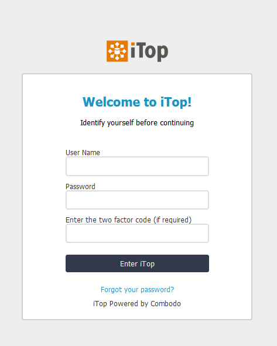
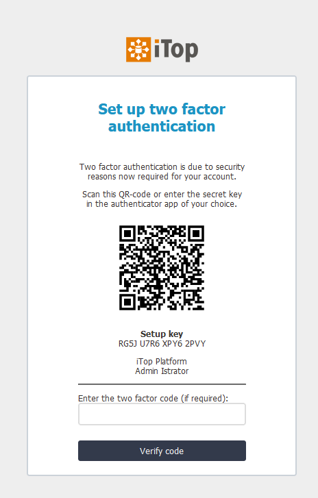
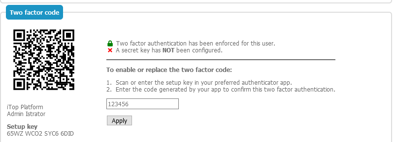
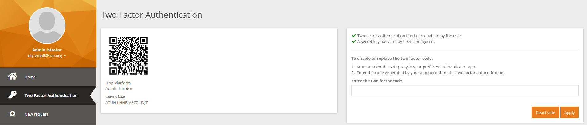
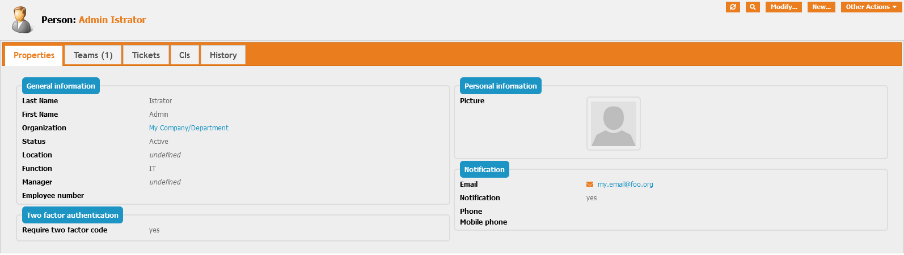

# jb-login-authenticator

Copyright (C) 2021 Jeffrey Bostoen

🍻 ☕

Need assistance with iTop or one of its extensions?  
Need custom development?  
Please get in touch to discuss the terms: **info@jeffreybostoen.be** / https://jeffreybostoen.be

## Pro extension

This extension was complex to develop and is now very feature rich, so this became a professional extension.

## What?
This extension makes it possible for iTop users to login in a more secure way.   
After the traditional login with regular credentials, it requires a two factor code.  
Users get this TOTP code from their preferred authenticator app.

The extension allows iTop administrators or users with modify rights on the Person class to enforce the use of a two factor code.  
Otherwise, the use of two factor authentication remains optional. 

Upon enforcement, users will be required to set up their two factor authentication after logging in with their basic plain credentials.

It should work with:
* Authy
* Authenticator extension for MS Edge, FireFox and Google Chrome
* Google Authenticator
* Microsoft Authenticator
* any generic authenticator app

## Video presentation

* https://www.youtube.com/watch?v=12Fb005uFJs

## Screenshots

The user can directly enter the two factor code when authenticating to iTop using classic credentials.  

If it's the first time and two factor authentication has been enforced in the backend,  
the user will have to set up a two factor code.  

The secret can be updated by the user (once authenticated) in the console (classic backend)  

The secret can be updated by the user (once authenticated) in the portal (modern frontend)  

In the current concept (this can become more strict upon development requests!),  
people with access to the person object can configure two factor authentication to be enforced.  

# Features which will be developed upon sponsoring

* Send TOTP token to e-mail
* Send TOTP token to SMS services (API documentation will be requested!)
* Bypass based on HTTP header or IP ranges

# Guide
* See documentation included with extension

## Translations
* none yet

## Requirements

* iTop 2.7
* PHP 7.2 or newer

* iTop extensions
  * [jb-authenticationmethod](https://github.com/jbostoen/itop-jb-authenticationmethod)
  
  
## Known issues/limitations

* The two factor secret is stored per user, not per contact. So the secret may be different depending on the login method ('form' vs 'external')
* One two factor secret per person

## Cookbook

XML:
* add an value to an existing dropdown list (AttributeEnum)

PHP:
* enhancing iTop's login process using available hooks

## Credits

To generate QR-codes, the [chillerlan/php-qrcode](https://github.com/chillerlan/php-qrcode) package is used.  
⚠ Currently restricted to versions 3.2 (still supports PHP 7.2); as since 4.0 PHP 7.4 is required!

The extension is also based on [PHPGangsta/GoogleAuthenticator](https://github.com/PHPGangsta/GoogleAuthenticator), released under a BSD-license.
It can generate secrets, generate codes, validate codes and present a QR-Code for scanning the secret.  
It implements TOTP according to RFC6238. A patch has been applied to make it compatible with Authy/Microsoft Authenticator/others.

