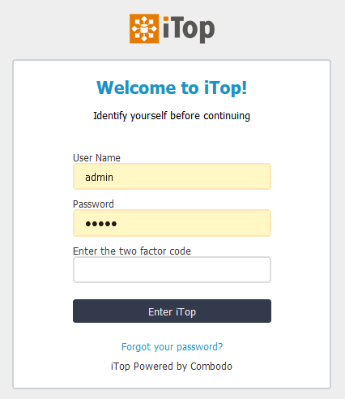

# jb-login-authenticator

⚠ This is still a (working) concept. Initial supporters will be able to determine features.
For now, it only works with classic (username/password) authentication.
Upon request and commitment, I'm willing to develop this so it could also work with for instance LDAP authentication.

Copyright (C) 2021 Jeffrey Bostoen

🍻 ☕

Need assistance with iTop or one of its extensions?  
Need custom development?  
Please get in touch to discuss the terms: **jbostoen.itop@outlook.com**

## Pro extension
This extension was complex to develop and is now very feature rich, so this became a professional extension.
If you want to use this extension and get support, please get in touch to discuss the terms: **jbostoen.itop@outlook.com**

## What?
Adds two factor authentication to iTop.

The two factor authentication can be enforced on the person object (due to technical limitations, it's not on the user object).

Upon initial enforcement, users will be forced to set up their two factor authentication upon first log on with plain credentials.

## Screenshots

The user can directly enter the two factor code when authenticating to iTop using classic credentials.

If it's the first time and two factor authentication has been enforced in the backend, the user will have to set up a two factor code.

The secret can be updated by the user (once authenticated) in the console (classic backend)

The secret can be updated by the user (once authenticated) in the portal (modern frontend)

In the current concept (this can become more strict upon development requests!),  
people with access to the person object can configure two factor authentication to be enforced.

# Guide
* See documentation included with extension

## Translations
* none yet

## Requirements
* iTop 2.7
* PHP 7.2 or newer

