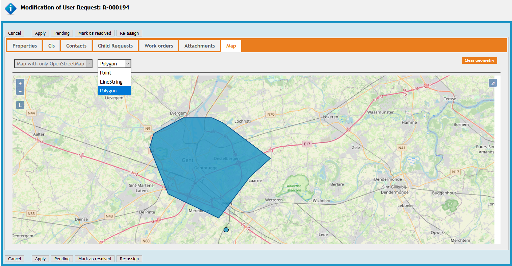
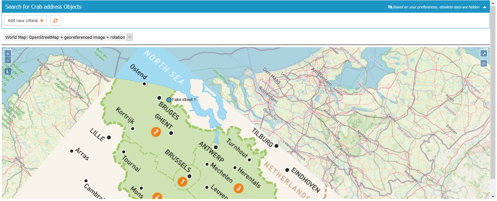

# jb-map
Copyright (C) 2019-2021 Jeffrey Bostoen

🍻 ☕

Need assistance with iTop or one of its extensions?  
Need custom development? Interested in this extension?  
Please get in touch to discuss the terms: **jbostoen.itop@outlook.com**

## Pro extension
This extension was complex to develop and is now very feature rich, so this became a professional extension.
If you want to use this extension and get support, please get in touch to discuss the terms: **jbostoen.itop@outlook.com**

## What?
Adds a **Map tab** to iTop objects ('detail view'). In this tab, it shows a map with the feature geometry (Point, LineString, Polygon).

There's also a **dashlet** to show all objects of a class on a map. Here, it also offers a search/filter bar.

**Map tab features**
* Adding, modifying or clearing the feature from the object details is very straight forward.
* Last used basemap is remembered per user and per class (cookie)

**Dashlet features**
* search form with a look similar to iTop's native search for objects
* a feature can be clicked upon to see its details in a popup. Customizable which attributes (text-based only) are shown.
* if a feature is clicked on while holding the [Alt]-key, iTop immediately redirects to the object details page
* if enabled, clicking on an empty spot on the map will result in redirection to a new object creation page with geometry (Point) prefilled.
* if enabled, objects are clustered on zooming out. Hovering over the cluster gives a sneak peak of the clustered features.
* last used basemap is remember per user and per dashlet (cookie)

**Configuration options**
* default zoom level
* default map center
* limit which types of features are allowed (Point, LineString, Polygon)
* source CRS (coordinate reference system)
* target CRS (coordinate reference system)
* add background maps (such as OpenStreetMap, Stamen, WMS, custom images, ...)
* set default map
* ...

**Custom PHP Interfaces**
* With these interface, additional controls can be added to the toolbar above the map or within the actual map (HTML) object.

## Requirements
* iTop 2.7 (might work with 2.6, untested so far)
* PHP 7.2 or newer

## Screenshots

### Details view

* There's a map tab when viewing the object details.  
* When modifying, there's an option to clear the geometry and pick a geometry type (Point, LineString, Polygon); predefined in the datamodel.  
* Extensions are possible (but not included), such as an address lookup bar.
* Maps can be rotated (ALT + Shift + drag) or put into fullscreen (small button top right).

### Dashlet

* Includes a dashlet with a search/filter bar, similar to iTop's native lists.  
* There's also a cluster feature. 
* Clicking the map on an empty spot will show the object creation dialog with the (point) geometry prefilled.  
* Clicking a feature shows (limited) details (only 'alphanumerical' attributes are supported at this moment, not pictures/data).  
* This dashlet uses a map with a georeferenced image.  

## Documentation
* See [Documentation](documentation.md)

## Limitations
* Currently 1 feature per object. 
  * It has to be a SinglePoint, SingleLineString or SinglePolygon. 
  * MultiPoint, MultiLineString, MultiPolygon or other geometry types are unsupported.
* Complex features with lots of points may be too large to store. (unlikely)
* Currently stored the same way as an AttributeText (so not a MySQL geometry field). This is done to limit future compatibility issues with iTop.
* Background layers (such as OpenStreetMap) require an active internet connection. However, it is possible to run a GIS server offline.
* Bulk modification: there's no map, just a field with a textual presentation of the coordinates.
* Images should be georeferenced in advance.

## Good to know
Using QGIS Desktop (open source and free):
* the data can be quickly visualized (not edited!) and geospatial analysis can be performed.
* images (such as floor plans etc.) can be georeferenced (put onto a real world map at the right spot)

## Translations
* French translation by Guillaume Lajarige (@Molkobain)

## Cookbook
XML: 
* how to add a new attribute type 'AttributeGeometry' to some classes (Location)

PHP: 
* how to add an extra tab to the details view
* how to add menus
* how to get current module settings
* how to obtain a list of all iTop attribute names to check if an attribute is present ('geom')
* how to get the label (translation) of attributes
* how to add a CSS style, a CSS stylesheet, additional JavaScript libraries, JavaScript and HTML code
* how to create a custom dashlet
* how to hide a field
* how to create a custom attribute type
* ...

iTop internals
* how to redirect to iTop new object creation page AND prefill information

## Libraries
* OpenLayers 6.5.0
* Proj4JS 2.6.3
