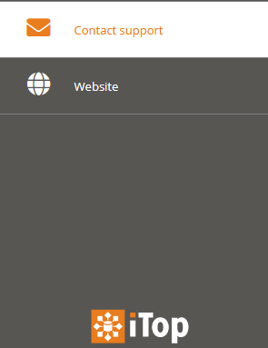

# jb-portal-url-brick

Copyright (C) 2022 Jeffrey Bostoen

[](https://github.com/jbostoen/iTop-custom-extensions/blob/master/license.md)
[](https://www.paypal.me/jbostoen)
🍻 ☕


Need assistance with iTop or one of its extensions?  
Need custom development?  
Please get in touch to discuss the terms: **info@jeffreybostoen.be** / https://jeffreybostoen.be


## What?

URL brick to use in the portal. Can be used to add any typical URI.

## Screenshots

Here for example "Contact support" and "Visit website" are URL bricks.  
Upon clicking "Contact support", the user's default e-mail client will open with the "To:" field prefilled.  
Upon clicking "Visit website", the organization's homepage will be shown.



## Cookbook

XML:
* Nothing

PHP:
* Implement a new brick


## How to add your own brick

Create a custom extension to customize the XML datamodel.  
You can add multiple URL bricks.

Here's an example of a "mailto:" link:

```
<?xml version="1.0" encoding="UTF-8"?>
<itop_design xmlns:xsi="http://www.w3.org/2001/XMLSchema-instance" version="1.6">
	<module_designs>
		<module_design id="itop-portal" xsi:type="portal">
			<bricks>
				<brick id="mailto-support" xsi:type="Combodo\iTop\Portal\Brick\UrlBrick" _delta="define">
					<active>true</active>
					<rank>
						<default>999</default>
					</rank>
					<width>4</width>
					<title>
						<default>Brick:Portal:MailToSupport:Title</default>
					</title>
					<description>Brick:Portal:MailToSupport:Title</description>
					<visible>
						<home>false</home>
					</visible>
					<decoration_class>
						<default>fa fa-globe fa-2x fa-fw</default>
					</decoration_class>
					<url>mailto:info@jeffreybostoen.be</url>
				</brick>
			</bricks>
		</module_design>
	</module_designs>
</itop_design>
```

## Sponsor features

- [ ] Make URL open in new window (current limitation)
